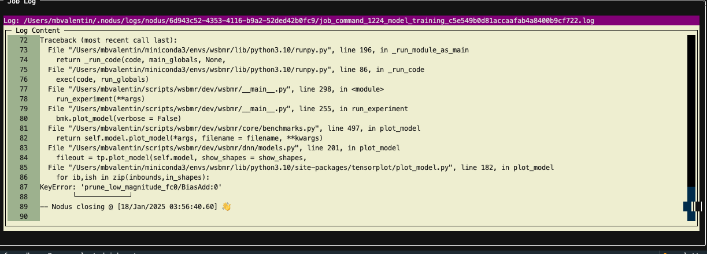

<!---
[@manuelbv]: DO NOT CHANGE THE FOLLOWING CODE!!!
-->

<div style="height: 100px; margin-right: auto; vertical-align: middle; position: relative; background: #4e2a84; padding: 5px;">
    
    
</div>

<!---
[@manuelbv] UP TILL HERE
-->


#### NetSurf : Weight-susceptibility based module replication for error resistant on-edge neural network accelerators

**Authors**:

* Manuel Blanco Valentin (manuelvalentin2028@u.northwestern.edu)
* Houxuan Guo (hguo@u.northwestern.edu)
* Xiuyuan He 

**Collaborators**:
**Supervisor**: Seda Ogrenci (seda@northwestern.edu)
**Project Start date**: 4/Jun/2024
**Last change**: 30/Jan/2025
**Github repo**: [GithubRepo](http://github.com/manuelblancovalentin/wsbmr)

---


## TODO

List of things that we should work on:
* Fix hessian and pruning error. We are getting an error when running a pruned model with hessian/hessian delta. For some reason there's a training error (see image below). Apparently inside fkeras, they use a "train" statement at some point, maybe to get the gradients, who knows (I didn't have time to check). And when you are using a pruned model, you need to pass some pruning callbacks into that. So yeah, that's breaking but it should be an easy fix.
* Find a dataset to test with LSTM model. Test.



* When running the GUI 

## HOW TO RUN

WSBMR/NetSurf has two modes of operation: 
* 1. Foreground using the GUI mode, which can be invoked using

```python
python -m wsbmr
```

* 2. To run in the background with no GUI, which can be invoked passing arguments. In this mode the job is run and once it finishes, the process ends. This, on its hand, has two basic modes of operation:
  - The first one, is just to run the training loop for the model (which is required for any method for that specific combination). This is useful when starting a new group of pruning/benchmark/quantization, since it guarantees that the model is trained but doesn't really run any bit-flip error injection. It can be invoked as seen in the first command below
  - The second one is to run it passing a method and some method config, which will also train the model (if the model doesn't exist OR if the retrain flag is on), but most importantly it will run the bit-flip error injection using the selected method (see second command below).

Training only:
```bash
  python wsbmr \
      --benchmarks_dir /Users/mbvalentin/scripts/wsbmr/benchmarks \
      --datasets_dir /Users/mbvalentin/scripts/wsbmr/datasets \
      --benchmark mnist_hls4ml \
      --bits_config num_bits=6 integer=0 \
      --prune 0.0 0.125 0.25 0.375 0.5 \
      --protection_range 0.0 0.2 0.4 0.6 0.8 \
      --ber_range 0.001 0.005 0.01 0.05 0.1
```

Training (if model not found) + bit-flip error injection:
```bash
  python wsbmr \
      --benchmarks_dir /Users/mbvalentin/scripts/wsbmr/benchmarks \
      --datasets_dir /Users/mbvalentin/scripts/wsbmr/datasets \
      --benchmark mnist_hls4ml \
      --bits_config num_bits=6 integer=0 \
      --prune 0.0 0.125 0.25 0.375 0.5 \
      --protection_range 0.0 0.2 0.4 0.6 0.8 \
      --ber_range 0.001 0.005 0.01 0.05 0.1 \
      --method bitwise_msb \
      --method_suffix msb \
      --method_kws <LOOK_AT_THE_CONFIG_PER_BENCHMARK_IN_THE_INIT_FILE_IN_WSBMR> \
      --plot 
```

##  How to cite this?

[@manuelbv] WE NEED TO MODIFY THIS TO ADAPT IT TO OUR ACTUAL BIBREF FROM DAC OR WHATEVER!!! I JUST COPIED THIS FROM MY NODUS REPO

If you found my work valuable and it was useful for you, consider citing it in any published work where you used it to help me improve the visibility of my code and make it easier for other people to access it, by adding the following bibtex entry to your paper:

```
@misc{MBValentin2020DynamicTable,
  author = {Valentin, Manuel Blanco},
  title = {Nodus: A lightweight and reusable job manager},
  year = {2025},
  publisher = {GitHub},
  journal = {GitHub repository},
  howpublished = {\url{https://github.com/manuelblancovalentin/nodus}}
}
```
